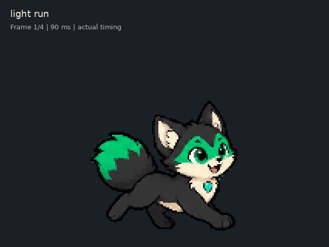
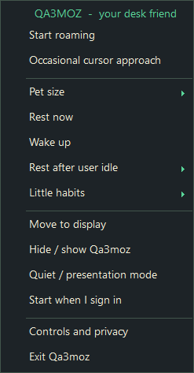

# Pawquilt

A small Windows desktop companion featuring Qa3moz, a green-tailed pixel fox who wanders, jumps, naps, and enjoys a gentle head stroke. Animation and behavior run locally in a C# / .NET Framework application.



**v0.1.0-preview** is an early Windows release. Code and documentation are [MIT licensed](LICENSE), copyright 2026 thorestic. The original AI-generated fox artwork is separately [CC BY 4.0 to the extent licensable](assets/ARTWORK-NOTICE.md); no exclusive rights in AI-generated elements are claimed.

## Try it

> **Preview download temporarily withdrawn.** On 2 October 2026, VirusTotal reported **5/71 engine detections** for the published `Pawquilt.exe` (SHA256 `2A3ABB06C4D7C56EA538FC25F5EE9106B3C43378535490763C8F42DCAE17AD94`). The result is under investigation; we have not established whether the detections are correct or false positives. The preview release is now a draft, and ready-to-run public downloads are unavailable. Source remains public. Do not bypass security warnings to run this preview.

When a reviewed release becomes available, extract the complete Windows ZIP. The portable bundle contains `Pawquilt.exe` and its `assets` folder. Keep those files together in a user-writable folder and double-click `Pawquilt.exe` from your normal Windows desktop. The EXE is not a standalone download. It starts roaming, with cursor approach off. A second instance in the same Windows session is refused.

Intended for Windows 10/11, x64, with .NET Framework / CLR 4 installed. The preview was compiled using the installed Framework64 compiler on one Windows laptop; other Windows versions and hardware have not been verified. Verify downloaded files against the release SHA256SUMS.txt; checksums identify bytes and do not prove safety. No installer, account, API key, or network connection is used.

This executable is unsigned. Windows application-control policy may block it. A trusted signed release or your organization's approval is the appropriate path on a restricted device; this project does not change security settings.

## Controls

| Action | Control |
| --- | --- |
| Pause / resume roaming | Ctrl + Alt + Shift + P |
| Exit immediately | Ctrl + Alt + Shift + Q |
| Toggle occasional cursor approach | Ctrl + Alt + Shift + F |
| Drag | Grab the visible body and move; release to land |
| Pet | Gently stroke the head; the happy response ends in a jump |
| Settings | Right-click the pet or its tray icon |

Transparent areas pass clicks through. Drag capture begins only after intentional movement. The pet moves without activating itself; a deliberately opened menu supports keyboard navigation and Escape. Exit is also available in the tray menu. If hotkey registration fails, startup stops with an error.

The compact menu includes size, pause, optional cursor approach, rest/wake, idle threshold, monitor placement, hide/show, quiet mode, and Little habits toggles.

Earlier menu layout preview (before the Pawquilt name change):



**Rest now** plays the new stretch/curl sequence and stays asleep through unrelated computer use. Choose **Wake**, grab the pet, or stroke its head to wake it. Automatic idle sleep wakes when activity resumes. The default idle threshold is three minutes; menu choices are one, three, or ten minutes.

**Quiet / presentation mode** hides the pet and messages until disabled through the tray. Fullscreen avoidance uses a conservative window-geometry heuristic, not game recognition. It avoids previously observed borderless fullscreen windows, moves to another available monitor, or hides when all displays are covered. Ordinary framed maximized windows and desktop surfaces are excluded.

**Start when I sign in** is optional. It creates only a current-user shortcut to this executable, and the same menu removes that shortcut. Keep the app in its final folder before enabling it. An existing same-name shortcut pointing elsewhere is left unchanged. This preview does not install a service or enable startup by itself.

## A little personality

Local weighted choices vary walking, light runs, jumps, pauses, and monitor transfers. An energy/warmth model, cooldowns, and recent choices influence the sequence; no AI API runs. Idle scratches or somersaults become eligible about every two to five active minutes. Artwork is fixed; order and timing vary.

An occasional paw request accompanies an Arabic affection bubble, initially eligible after 12–20 active companion minutes. Petting postpones it; subsequent requests have a 20–30 minute cooldown. A gentle break reminder becomes eligible after about 50 minutes of approximate active input, at most once an hour; two minutes idle resets that counter. Messages last five seconds and never appear during pause, sleep, menus, dragging, flight, quiet mode, or known fullscreen use. All these habits have toggles. There is no guilt, punishment, or required care.

## Privacy and local files

No networking, telemetry, screen capture, OCR, keyboard hooks, key contents, or input-history logging. OS last-input age indicates aggregate inactivity. Cursor coordinates are used for optional approach and intentional dragging; mouse events are handled on the pet itself. Passive fullscreen checks read geometry/visibility/identity, not titles or content. See [privacy details](docs/PRIVACY.md).

The app may write five preference booleans to `behavior-settings.json`, its own startup/error metadata to `diagnostic.txt`, and a source-art diagnostic frame to `diagnostic-frame.png`, all beside the executable. These are excluded from source staging. The diagnostic frame is rendered artwork, not a desktop screenshot. Windows login startup is changed only through an explicit control.

## Project layout

```text
Pawquilt/
├── src/          C# application and runtime logic
├── tests/        Model, rendering, integration and native preflight checks
├── scripts/      Build and focused verification scripts
├── docs/         Privacy, provenance, release notes and artwork previews
├── assets/       Runtime sprites, timing manifest and separate art license
├── app.manifest  Windows compatibility, DPI and privilege declaration
├── LICENSE       MIT software license
└── README.md
```

Build output goes to ignored `bin/`, with its own adjacent `assets/` copy. The published preview ZIP remains unchanged; it keeps the simple EXE-plus-assets layout for users.

## Build

No NuGet packages are required. The script uses the existing Windows .NET Framework compiler:

```powershell
.\scripts\build.ps1
```

This builds the app and test executable into `bin/`, copies runtime assets beside them, and runs the deterministic tests; it does not launch the pet. `-Stage` writes `.next.exe` outputs instead. For a compile-only check, use `-SkipTests`, then run the focused script below. If script execution or compilation is restricted, use your approved development environment; do not change OS policies to build this preview.

Optional validation commands:

```powershell
.\scripts\verify-six-moves.ps1
.\bin\PawquiltTests.exe --check-pixel
.\bin\PawquiltTests.exe --preflight
```

The focused script compiles and runs six-move integration checks. Pixel validation checks the original eleven-state set; the focused script checks the six additions. Preflight creates a message-only window and briefly registers/releases hotkeys; close a running companion first to avoid registration conflicts. Tests do not prove native click delivery, focus, hotkey delivery, or every display arrangement.

To start a source-built app paused from a terminal, use `.\bin\Pawquilt.exe --paused`. Normal launch starts roaming. Do not start it from a noninteractive/private desktop and expect to see it on the user's desktop.

## What has been verified

The saved core passed its deterministic suite and base-art render checks. The six-move integration subsequently compiled and passed 6,087 focused checks, including 52 renders of the 26 new frames, manual/automatic sleep, pet-to-jump/landing, pause, drag cancellation, timing and a seeded mixed-DPI movement trajectory. Native launch loaded 63 frames, registered controls, and placed an opaque own window within monitor bounds. A user confirmed the pet appeared and performed the happy jump.

Further hands-on verification remains for fullscreen/quiet recovery, bubble click-through/focus, lock/unlock, disconnects during motion, and broader monitor/DPI combinations. Secure lock and UAC desktops are not overridden. Actual computer sleep suspends the application. Horizontal adjacent monitors use a visible crossing arc; separated or vertical layouts currently use a bounded fade handoff. This is a preview, not a claim of comprehensive hardware testing.

See [artwork and dependency provenance](docs/PROVENANCE.md) and [preview release notes](docs/RELEASE-NOTES.md).
